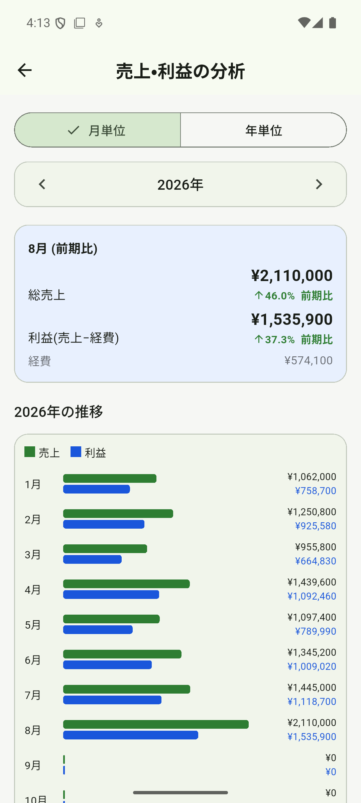
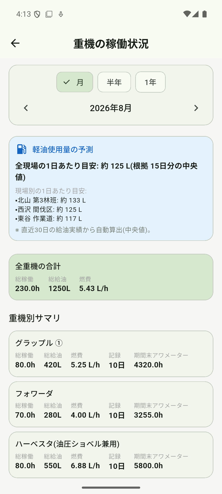
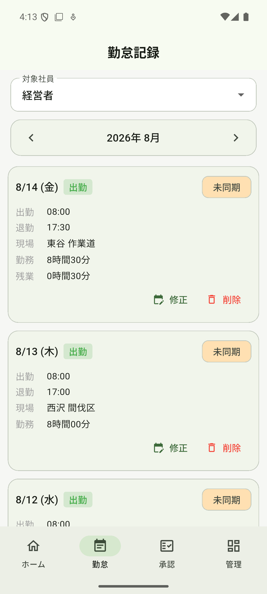
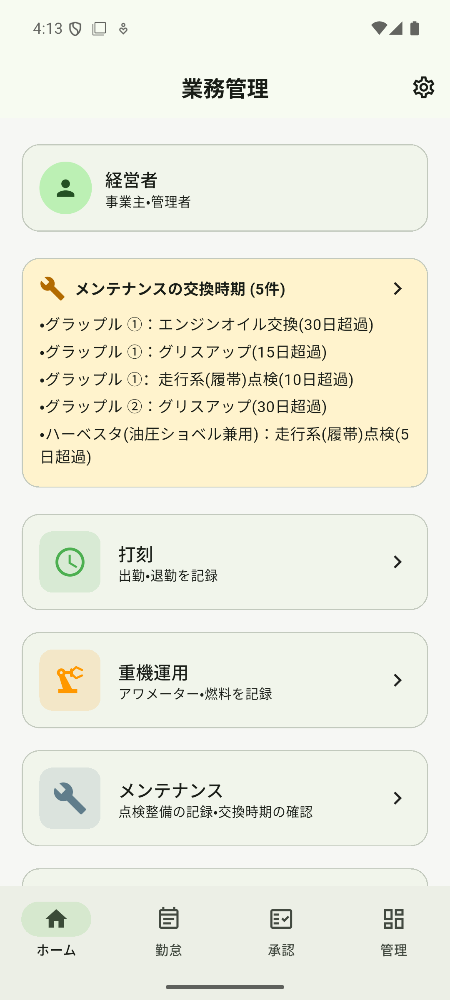
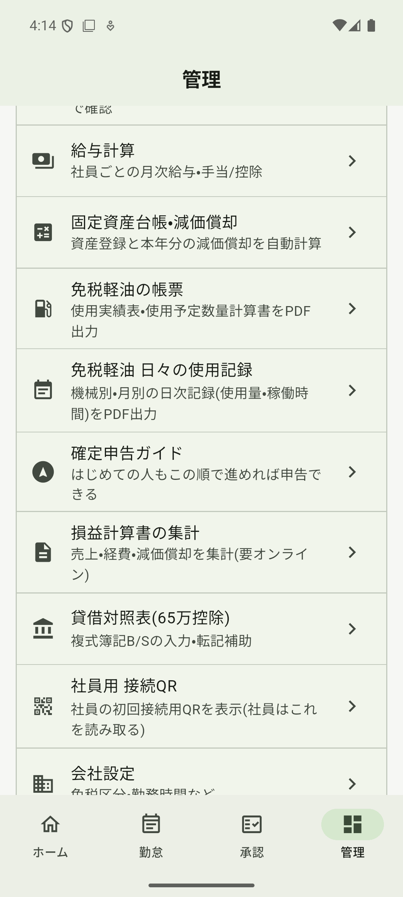
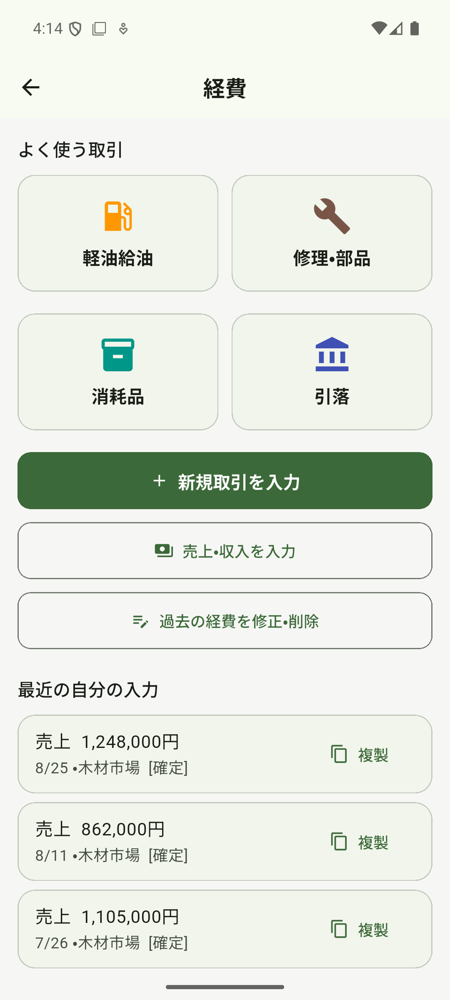

# Portfolio

人事給与システムのQA・テストエンジニア（実務）× 個人開発者。

**「テストする側」と「作る側」の両方の視点**を持ち、**生成AIを業務に組み込みながら**、業務システムの品質と実装の双方に取り組んでいます。要件が明確でない状態からの要件整理・設計・実装・テスト・運用までを単独で担当した実績があります。

> 各プロジェクトは業務利用中のシステムおよび個人資産を扱うため、**ソースコードは非公開**としています。
> 実装内容・技術選定・設計上の判断について、面談等で詳しくご説明できます。

---

## 個人開発

### 1. 林業事業者向け 経費・勤怠・給与管理システム（実運用中）

林業事業者の経費精算・勤怠管理・給与計算を一元化する業務システム。
**企画から要件整理・設計・実装・テスト・リリース・運用保守まで単独で担当**し、現在も実業務で稼働中です。

利用者は手書き帳簿で記録しており、「何に困っているか」自体が言語化されていない状態からのスタートでした。業務フローを可視化したうえで段階的な移行計画を立てて導入しています。

**規模**: Dartコード 約53,000行 ／ 画面 47 ／ 自動テスト 43本

**主な実装機能**

| 領域 | 内容 |
|------|------|
| 経費管理 | レシート撮影 → **オンデバイスOCR** による自動登録、勘定科目の自動判定 |
| 稼働管理 | 重機・車両の稼働記録、社員の勤怠管理（振替出勤に対応した日単位の休日カレンダー） |
| 保全管理 | メンテナンス項目の周期管理（日数・稼働時間の二軸）と交換時期の自動判定 |
| 給与 | 給与計算、**賃金台帳PDFの自動生成**、給与の経費自動計上（冪等処理） |
| 会計 | **確定申告用 決算書PDF出力**（損益計算書／減価償却明細／貸借対照表）、固定資産台帳と減価償却の自動計算 |
| 税制対応 | **免税軽油の帳票出力**（使用実績表・使用予定数量計算書・日々の使用記録）— 軽油引取税の免税制度に対応 |
| 分析 | 月次／年次の売上・利益推移と前期比、**軽油使用量の予測**（直近実績の中央値から現場別に自動算出） |
| 証憑保管 | Google Drive への自動保存（年月フォルダ階層・容量監視付き） |
| 基盤 | オフライン対応、複数端末間のデータ同期、役割別アクセス制御、QRによる社員端末の初回接続 |

**画面**

> 以下はすべて**テストモードで生成した架空のデモデータ**です。実在の個人・取引先・現場は含まれません。

| 売上・利益の分析 | 重機の稼働状況 | 勤怠記録 |
|:---:|:---:|:---:|
|  |  |  |
| 月別の売上・利益と前期比を自動集計 | 実績から現場別の軽油使用量を予測 | 出退勤・現場・残業を日次で記録 |

| ホーム | 管理メニュー | 経費入力 |
|:---:|:---:|:---:|
|  |  |  |
| 交換時期を過ぎた整備項目を自動通知 | 決算書・免税軽油帳票・給与計算 | よく使う取引をワンタップで入力 |

**設計上の工夫**

- **データ物理分離アーキテクチャ**: 利用企業ごとにFirebaseプロジェクトを分離し、給与データなど機微情報の管理責任を明確化
- **認証設計**: Email/Password認証 + 権威マッピングによる社員単位の識別、Firestore セキュリティルールによる役割別の権限分離
- **冪等な自動計上処理**: 給与確定時の経費計上を月次で冪等化し、二重計上を構造的に防止
- **オフラインファースト**: 山間部など通信環境が不安定な現場での利用を前提に、ローカル優先のデータ同期を設計
- **環境分離**: テスト環境から本番データベースへ接続しない初期化ガードを実装し、検証時の事故を防止
- **汎用構造**: 特定企業向けの決め打ちを避け、設定の差し替えで他社へ展開できる構造（賃金体系は月給／日給月給／日給／時給の4方式に対応）

**開発の進め方**

開発には **AIエージェント（Claude Code）** を用いています。何を作るか、業務要件をどう構造に落とすか、どの技術を選ぶか、出てきたものが正しく動くかの検証と運用判断は、すべて自分で行っています。自動テストを43本整備しているのも、変更のたびに人がすべて見直すことは現実的でないため、**壊れたら気づける状態を先に作ってから実装を進める**という方針によるものです。

**技術構成**: Flutter / Dart / Firebase（Firestore・Authentication・Security Rules）/ Google Drive API

---

### 2. 株式投資 分析・記録ツール

投資判断の記録と検証を自動化するツール。

- **GitHub Actions（cron）による PC非依存の自動記録パイプライン** — ローカル環境の起動状態に依存せず、market データを定期収集
- 保有銘柄のCSV取込による同期
- 推奨銘柄の的中率を**ベンチマーク相対（市場超過）で測定する検証基盤**を実装。検証の結果、当初の仮説が統計的に成立しないことを確認し、設計を見直した

**技術構成**: Python / GitHub Actions / SQLite / Parquet

---

### 3. AI画像・動画生成の自動化パイプライン

生成AIワークフローを業務レベルで自動化した個人プロジェクト。

- 日本語入力 → プロンプト自動構築 → バッチ生成の一連を自動化
- ComfyUI を用いた画像→動画（Image-to-Video）の連鎖生成処理
- ローカルGPU環境での完結処理（外部APIへのデータ送信なし）。CUDA環境の構築を含め実行環境を自身で整備

**技術構成**: Python / ComfyUI / Stable Diffusion 系ツール

---

## 生成AIの業務活用（現職での取り組み）

社内に生成AIのナレッジがほとんど無い状態から、**課題発見 → 技術選定 → 実装 → 効果測定 → 社内展開**まで、いずれも自ら着手しました。

| 取り組み | 内容と成果 |
|---|---|
| **社内Q&Aチャットボット（ローカルRAG型）** | 社内文書を外部の生成AIサービスへ送信できないという制約のもと、**ローカル完結型のRAG**を企画・技術選定・実装。回答には必ず出典を付与。構成は llama.cpp／Qwen3.5-4B（Q4_K_M）／bge-m3／bge-reranker。採用候補については**商用利用の可否とデータ処理地域を公式資料で確認**したうえで選定 |
| **定型業務の自動化** | 勤怠管理SaaS「KING OF TIME」の打刻チェック・一括申請を自動化するツールをAIエージェントで開発。**一人あたり月30分 → 10分（約67%削減）**。同じ作業を行うメンバーが使える形に整えて展開 |
| **受講期限リマインドの自動化** | Power Automate で受講期限を検知し Microsoft Teams へ自動通知（対象10名）。**受講期限の超過が発生しなくなった** |
| **コーディングエージェントの比較調査** | Claude Code と Codex について、**モデル別・推論レベル別のトークン消費量を実測**し、同一課題での成果物品質を比較評価。用途別の使い分け指針として**全社へ共有** |
| **AI活用の社内浸透** | AIを用いたゲーム・LPを制作して社内公開し、未利用者の関心を喚起。**AI活用推進グループの参加者が5名 → 10名へ増加** |

> AIの出力をそのまま成果物にはせず、**必ず自分で動作と根拠を確認してから採用する**ことを徹底しています。調べる作業は任せて速度を上げ、会社に不利益が及ぶ判断は自分で原典を確認する、という切り分けで進めています。

---

## 職務経歴

**2023年12月〜現在　独立系SIer ／ QA・テストエンジニア（チームリーダー）**

企業向け人事給与システム（Java / Oracle）のQA・テストを担当。参画4ヶ月目からメンバー5名のテストチームリーダーを担当しています。

- 単体／結合／総合テストの**全工程**を担当
- テスト設計、テスト実行、不具合の切り分け、修正対応
- Javaアプリケーションおよび**ストアドプロシージャの修正**
- 担当規模: 画面20枚程度、機能7区分（バッチ処理・入力チェック等の単位では50機能以上）

**取り組んだ改善**

- **テーブル項目変更時の影響範囲チェックリストを作成**し、DB定義変更に起因するテスト漏れ・デグレードを防止する仕組みを構築
- 定期作業の手順書を整備し、属人化していた作業を標準化
- **RPA（WinActor）による業務フローの自動化**
- 生成AIの社内活用を主導（上記「生成AIの業務活用」を参照）

前職では製造業（木工家具）・林業・法人営業に従事し、**業種を問わず属人化や非効率を仕組みで改善**してきました。製造業ではQC活動のリーダーとして材料の取り出し時間を20分から5分へ短縮しています。

---

## スキル

**区分**: 実務＝業務で使用 ／ 個人開発＝業務外で構築し運用まで実施 ／ 学習＝スクールでの習得

| 分類 | 内容 | 区分 |
|------|------|------|
| テスト／QA | テスト設計、テスト実行（単体・結合・総合）、不具合切り分け、影響範囲分析、テストチームのリーダー | **実務** |
| Java、SQL（Oracle／ストアドプロシージャ） | 人事給与システムのテスト設計・実行、欠陥対応・修正 | **実務** |
| 生成AI活用（Claude Code / Codex） | 業務自動化ツールの開発、モデル別・推論レベル別の消費量と品質の比較検証 | **実務＋個人開発** |
| ローカルLLM・RAG（llama.cpp / Qwen3.5-4B / bge-m3 / bge-reranker） | ローカル完結型Q&Aチャットボットの技術選定・構成設計・実装 | **実務** |
| Power Automate／Microsoft Teams | 業務フローの自動化と通知連携 | **実務** |
| RPA（WinActor） | 定型的な業務フローの自動化 | **実務** |
| Flutter / Dart | 実運用アプリの設計・実装・保守（約53,000行／47画面／自動テスト43本） | **個人開発（実運用）** |
| Firebase（Firestore / Authentication / Security Rules）、Google Drive API | 認証・権限設計、オフライン対応、データ同期、データ分離アーキテクチャ | **個人開発（実運用）** |
| Python、Git / GitHub / GitHub Actions | 自動化スクリプト、データ記録パイプライン、cron による自動実行 | **個人開発** |
| JavaScript（GAS） | 自動化スクリプトの作成 | **個人開発** |
| Ruby / Ruby on Rails、AWS（Cloud9） | 4人1組のチーム開発でECサイトを制作 | **学習**（スクール） |
| 業務ドメイン | 人事・給与計算・勤怠・経費・確定申告実務 | **実務＋個人開発** |
